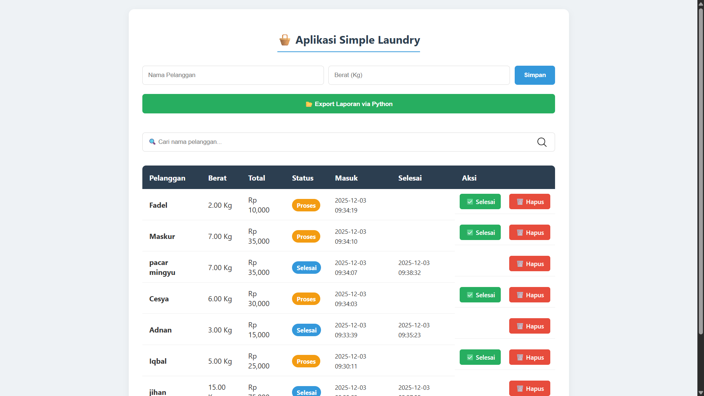
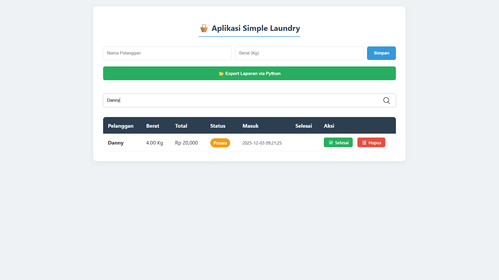
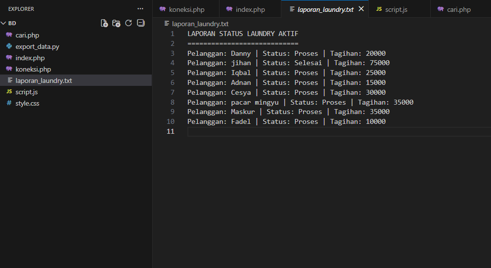

<div align="center">

  <h1>🧺 Simple Laundry Management System</h1>
  
  <p>
    Aplikasi manajemen laundry berbasis web dengan integrasi <b>PHP, Python, dan MySQL</b>.
    <br>
    Dilengkapi fitur otomatisasi database (Trigger & Stored Procedure).
  </p>

  
  
  
  

  <br><br>
</div>

---

## 📸 Screenshots

Berikut adalah tampilan antarmuka aplikasi:

| Dashboard Utama | Fitur Pencarian & Aksi | Output Laporan (Python) |
|:---:|:---:|:---:|
|  |  |  |
| *Tampilan daftar antrian* | *Filter data & Tombol Aksi* | *File txt hasil generate* |

---

## ✨ Fitur Unggulan

Project ini dibuat untuk memenuhi tugas **Basis Data Lanjut**, dengan menerapkan:

* ✅ **CRUD Operations:** Create, Read, Update, Delete data transaksi.
* ✅ **Live Search:** Pencarian real-time menggunakan AJAX (Tanpa reload).
* ✅ **Cross-Language Integration:** PHP memanggil script Python untuk fitur *Export Data*.
* ✅ **Advanced Database Logic:**
    * `Stored Procedure`: Standarisasi input data transaksi.
    * `Trigger`: Otomatis mengisi *timestamp* saat status "Selesai".
    * `Function`: Kalkulasi otomatis total biaya berdasarkan berat.
    * `View`: Query khusus untuk pelaporan data aktif.

---

## 📂 Struktur Project

```text
simple_laundry/
├── 📂 screenshots/       # Aset gambar untuk dokumentasi
├── index.php             # Halaman utama & Controller
├── cari.php              # Helper untuk AJAX Search
├── koneksi.php           # Konfigurasi Database
├── export_data.py        # Script Python (Worker)
├── style.css             # Modern CSS Styling
├── script.js             # Logic Frontend
└── README.md             # Dokumentasi Project
````

-----

## 📖 Dokumentasi Teknis (Codebase)

<details>
<summary><b>Klik untuk membuka Penjelasan Kode & Database</b></summary>
  
<br>

### A. Arsitektur Database (MySQL)

**1. Tabel `transaksi`**
Menyimpan data pelanggan, berat cucian, total harga, dan status pengerjaan.

**2. Stored Procedure: `tambah_cucian`**
Digunakan oleh PHP untuk input data.

```sql
CALL tambah_cucian('Nama Pelanggan', 4.5);
-- Procedure ini otomatis memanggil Function hitung_biaya()
```

**3. Trigger: `update_waktu_selesai`**
Bekerja saat status diupdate menjadi 'Selesai'.

```sql
IF NEW.status = 'Selesai' THEN SET NEW.tgl_selesai = NOW();
```

### B. Backend Logic (PHP & Python)

**Integrasi Python:**
Fitur export tidak dikerjakan oleh PHP, melainkan mendelegasikan tugas ke Python agar beban server terbagi.

```php
// index.php memanggil command line
$output = shell_exec("python export_data.py");
```

**Logika Tombol Aksi (UX):**
Sistem menggunakan logika kondisional pada tampilan:

  - Status **Proses**: Muncul tombol [✅ Selesai] dan [🗑️ Hapus].
  - Status **Selesai**: Tombol [✅ Selesai] disembunyikan (invisible) untuk menjaga layout tetap rapi.

</details>

-----

## 🚀 Cara Instalasi

### 1\. Persiapan Database

Buat database `laundry_db` dan jalankan query SQL yang telah disediakan.

### 2\. Setup Folder

Clone repo ini ke dalam folder `htdocs` (jika menggunakan XAMPP).

```bash
git clone [https://github.com/username/simple-laundry.git](https://github.com/username/simple-laundry.git)
```

### 3\. Install Dependensi Python

Pastikan Python terinstall, lalu install driver MySQL:

```bash
pip install mysql-connector-python
```

### 4\. Jalankan

Buka browser dan akses `http://localhost/simple_laundry`

-----
<div align="center"> <small>Dibuat untuk Tugas Kuliah Manajemen Informatika - Universitas Negeri Surabaya</small> </div>

